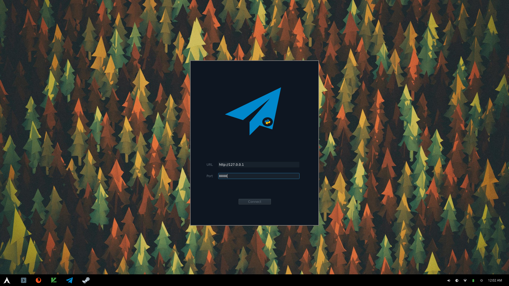
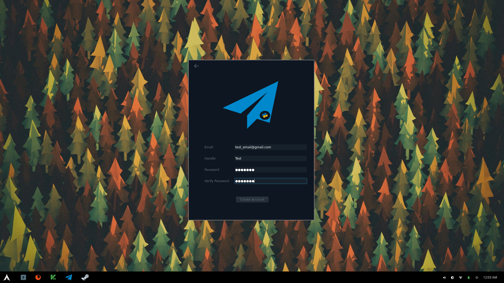
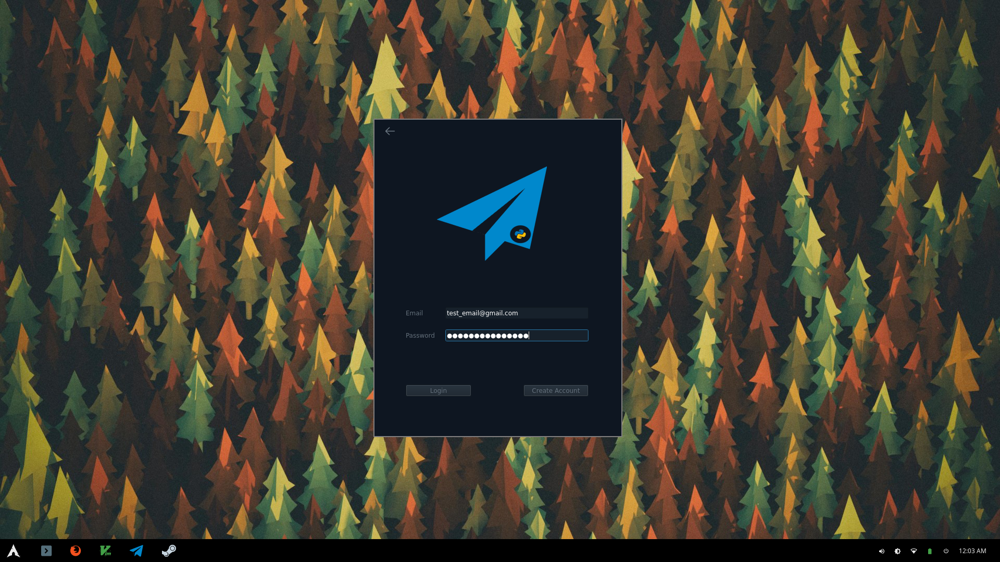
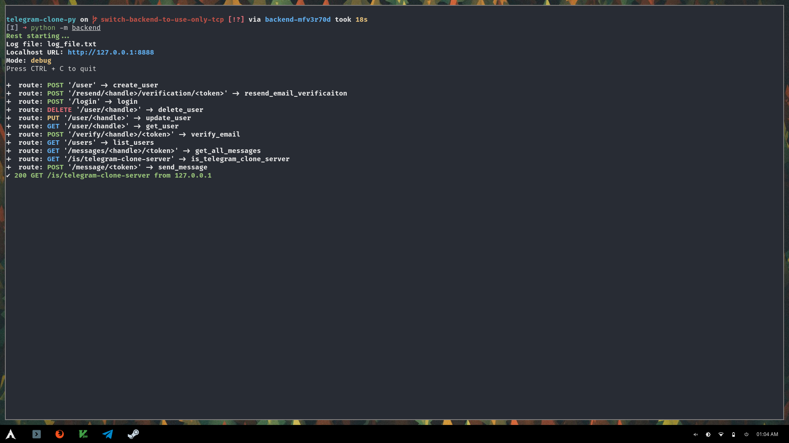
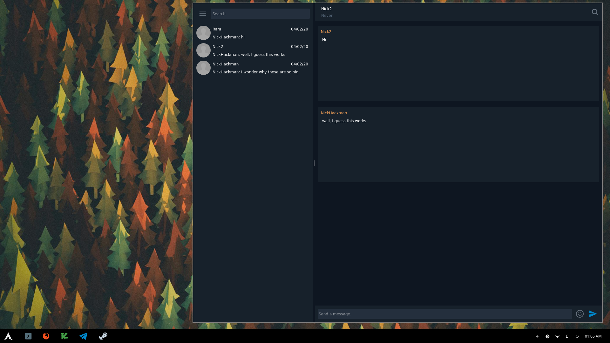

# telegram-clone-py

[](https://travis-ci.com/NickHackman/telegram-clone-py)

A Clone of Telegram written from the ground up, with a goal of security. Split
into [frontend](https://github.com/NickHackman/telegram-clone-py/tree/master/frontend) and [backend](https://github.com/NickHackman/telegram-clone-py/tree/master/backend)

## Purpose

This Telegram clone is written in Python for a computer science course at [Ohio
State University](https://www.osu.edu/), CSE 3461. The purpose of
this clone is to satisfy the requirements of that lab.

- Server and Client communicate via `TCP`
- Server must respond to a minimum of 5 different commands
- configuration file for port the server will listen on
- Server startup message
- Either prompt or use a configuration file to allow client to pick which server
  to connect to and port
- Server and Client work from 2 different IP addresses

| Assignment                            | Points |
| ------------------------------------- | ------ |
| Software submission                   | 75     |
| Demonstration / Review meeting        | 25     |
| **Bonus** Client-side GUI             | +2     |
| **Bonus** User Authorization          | +2     |
| **Bonus** Server-side command logging | +1     |
| Total                                 | 105    |

### Choices

Language: `Python`
Platform: Agnostic, but favoring `Linux/Unix`, depends on `GUI` library choice

## Database Planning


## Goals

### Server

- Built on top of a custom implementation of a Web App Framework similar to [Flask](https://flask.palletsprojects.com/en/1.1.x/)\*
- Server follows `REST` principles
- Utilize `Sqlite3` as the DBMS
- Verifiy Users Email addresses
- Utilize [Python-RSA](https://github.com/sybrenstuvel/python-rsa/) to maintain
  end to end encryption of messages
- Follow best practices for security
- Use websockets to send and recieve messages from client

[Web App Framework documentation](https://github.com/NickHackman/telegram-clone-py/blob/master/backend/rest/README.md)

### Client

- Utilize [PyQT](https://github.com/PyQt5/PyQt) for GUI
- Built on top of a custom implementation of HTTP Requests similar to [Requests](https://2.python-requests.org/en/master/)\*
- Utilize [Python-RSA](https://github.com/sybrenstuvel/python-rsa/) to maintain
  end to end encryption of messages
- Behave and look similarly to Telegram-desktop
- Allow `Markdown` in chat messages **Unfinished**
- Allow emoji in chat messages along with an emoji selector menu **Unfinished**

[HTTP Request Library documentation](https://github.com/NickHackman/telegram-clone-py/blob/master/frontend/requests/README.md)

_\*_ Objectively **WORSE**

## Install

### Dependencies

- Python 3.8
- pip
- pipenv

### Frontend

```sh
cd frontend/
pipenv install
pipenv shell
cd ../
python -m frontend
```

### Backend

```sh
cd backend/
pipenv install
pipenv shell
cd ../
python -m backend
```

## Screenshots

Connect to server screen


Create Account


Login


Server


Main Screen


## Future objectives

- Switch form polling the server every so many seconds to `websockets`
  1. Switch to websockets circumvents all the hacky refreshing
- Add Markdown support
- Add emoji menu
- refractor Qt mess
  1. Code generated by Qt Designer isn't pythonic and has massive issues
- Testing
- Implement settings window
  1. allow updating account (server side already supports)
  2. allow deleting account (server side already supports)
  3. allow resending email verification
- Fix sending email verification (for some reason doesn't work with Gmail)

## Takeaways

- Writing abstractions for the backend and learning how `HTTP Requests` work and
  are processed was incredibly interesting
- GUI design and layout was tedious, difficult, and the most time consuming

## Thanks

All Icons are from [Icons8](https://icons8.com)

## License

[GPLv3](https://github.com/NickHackman/telegram-clone-py/blob/master/LICENSE)
